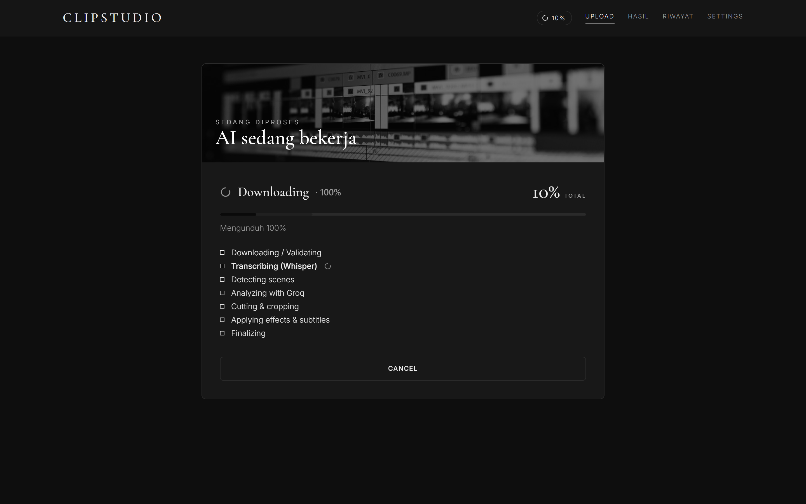
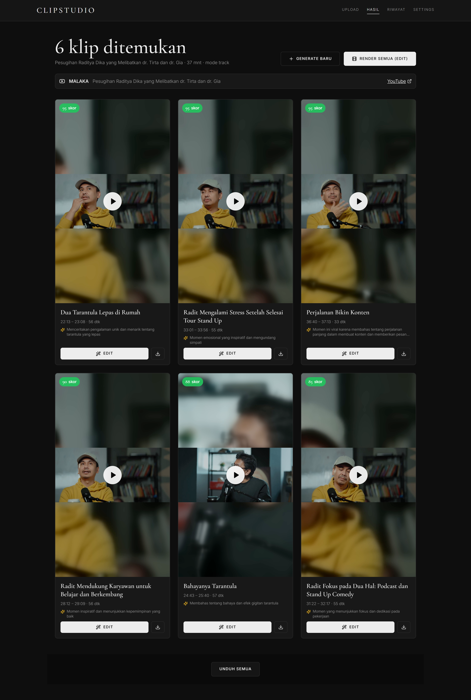
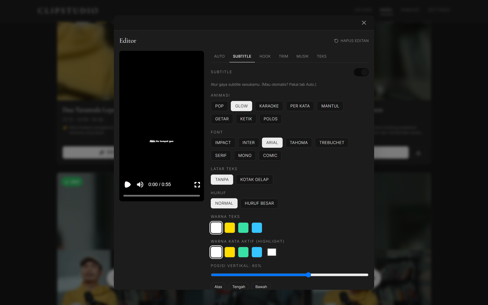

# ClipStudio

Self-hosted AI video clip generator. Drop in a long video (file upload or YouTube
URL) and ClipStudio transcribes it, uses an LLM to find the viral moments, cuts
and crops them to vertical 9:16, then lets you polish each clip in a live
in-browser editor — animated subtitles, AI hooks, zoom/grade effects, trim and
music — and render finished **1080×1920 MP4s** ready for TikTok / Reels / Shorts.

The preview *is* the render: the editor and the final export run the exact same
[Remotion](https://remotion.dev) composition, so what you see is what you get.

## Screenshots

| Landing | AI working — live pipeline progress |
|---|---|
|  |  |

| Results — clips ranked by viral score | In-browser subtitle & hook editor |
|---|---|
|  |  |

## Features

- **AI moment detection** — Whisper transcribes, then Groq (Llama 3.3 70B) reads
  the timestamped transcript and picks 2–6 self-contained viral moments (no blind
  fixed-length cuts).
- **Face-tracking 9:16 crop** — MediaPipe face detection with a YOLOv8 fallback
  and PySceneDetect cut awareness keeps the subject centered.
- **Live in-browser editor (Remotion)** — preview equals final output:
  - Word-level **subtitles** with `word-by-word`, `pop`, `glow` and `karaoke`
    animations; configurable position, color and size.
  - AI-generated **hook overlay** (badge + headline, custom colors).
  - **Auto AI effects** — structured zoom + color-grade segments, zoom centers
    refined from detected faces.
  - **Trim** and **background music** per clip.
  - One-click **caption / title / hashtag** generation.
- **Browser-side rendering** — final encode runs in the browser via
  `@remotion/web-renderer` (WebCodecs), so there's no separate render service.
  Render one clip or **Render All** in a batch.
- **1080p YouTube downloads** — yt-dlp + Deno + `yt-dlp-ejs` solve YouTube's JS
  challenges; optional cookies unlock DASH streams.
- **GPU-accelerated** — CUDA Whisper + NVENC encoding, with automatic CPU
  fallback.

## Stack

- **Backend:** Python 3.11, FastAPI, faster-whisper (CUDA), Groq API
  (`llama-3.3-70b-versatile`), OpenCV, MediaPipe, YOLOv8, PySceneDetect, yt-dlp,
  FFmpeg.
- **Frontend:** React 18 + Vite + Tailwind, Remotion 4 (`@remotion/player`,
  `@remotion/media`, `@remotion/web-renderer`), Lucide icons.
- **Infra:** Docker + Compose, NVIDIA Container Toolkit (≈6 GB VRAM target).

## Quick start (GPU)

```bash
cp .env.example .env
docker compose -f docker-compose.yml -f docker-compose.gpu.yml up --build
```

Open <http://localhost:5175>.

## CPU-only / no Docker (dev)

```bash
# Backend
cd backend
python -m venv .venv && . .venv/Scripts/activate   # PowerShell: .venv\Scripts\Activate.ps1
pip install -r requirements.txt
uvicorn main:app --reload --port 8000

# Frontend (separate terminal)
cd frontend
npm install
npm run dev
```

## Configuration

1. Open **Settings** in the app.
2. Paste your **Groq API key** (free at <https://console.groq.com>). It is stored
   only in your browser's localStorage and sent per-request via the `X-Groq-Key`
   header — never persisted server-side.
3. *(Optional)* Paste YouTube cookies to unlock 1080p downloads (export with a
   "Get cookies.txt" browser extension).

## Notes

- API keys are per-user and per-request, so the app can be shared without baking
  in any credentials.
- GPU is auto-detected (`torch.cuda.is_available()`); it falls back to CPU with a
  warning, not an error.
- Jobs persist on disk under `jobs/{job_id}/`, survive browser refreshes, and are
  auto-deleted after a configurable window (default 24h).
